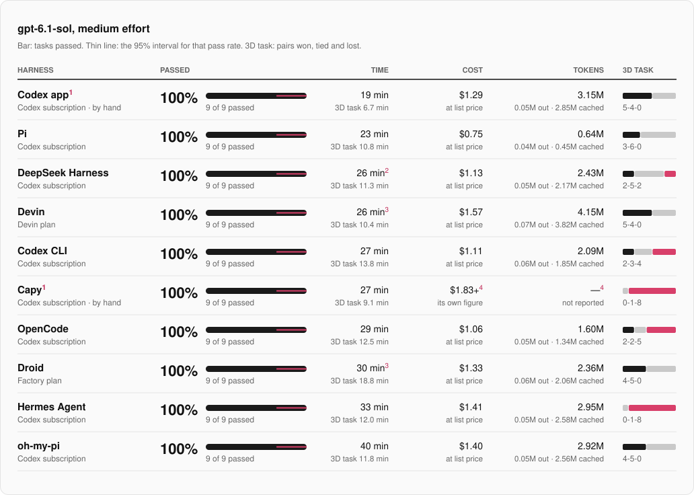
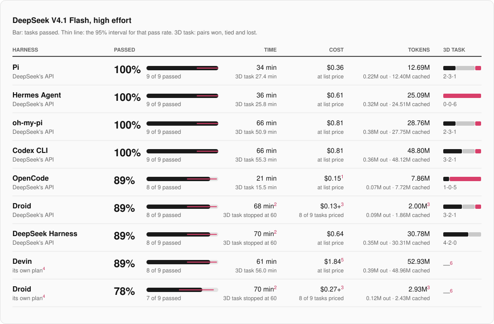
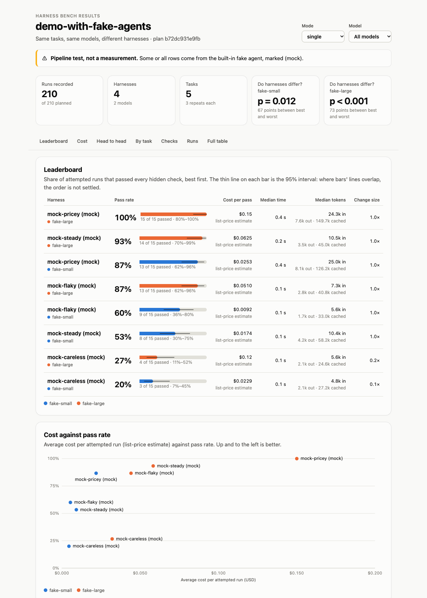
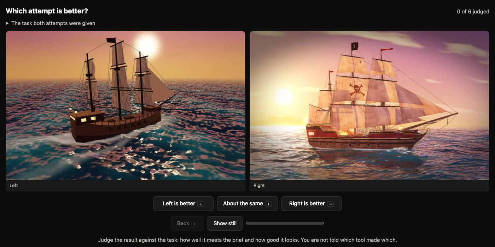
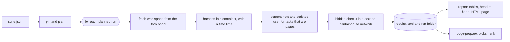

# Harness Bench

Does the coding harness matter, or only the model? Harness Bench runs the same tasks with the same models through different agent harnesses (Codex, Pi, oh-my-pi, OpenCode, Hermes, Devin, Droid, DeepSeek Harness, and desktop apps run by hand; an adapter for Claude Code exists but was not part of the first pass) and reports pass rate, time, tokens and cost for each, with the statistics needed to tell a real difference from run-to-run noise.

> **Status (2026-10-08): a first pass has been run.** Ten harnesses, nine tasks, one run each (216 runs). Read the [first-pass report](https://waveorwaves.github.io/harness-bench/first-pass/) ([as Markdown](docs/first-pass/README.md)) with its limits before quoting any number: with one run per cell, no difference in pass rate is statistically clear. Repeats two and three of the plan have not been run.

## Key findings

- **The harness did not change whether the work got done.** With gpt-6.1-sol at medium effort, all ten harnesses passed all nine tasks: 90 of 90 runs.
- **It changed the bill.** The same nine tasks took 19 to 40 minutes, 0.64M to 4.15M tokens and $0.75 to $1.57 at list price. Pi was the cheapest and the Codex app the fastest.
- **The fastest harness was the one that could look at its own work.** The Codex app has a browser tool built in and made its 3D page in 6.7 minutes; the Codex CLI, same model and same maker, took 13.8. The app also ran outside the sandbox, so part of that gap is the setting.
- **Passing the checks was not the same as being finished.** Every 3D page that was judged passed the automatic checks. Judged blind, side by side, five of the ten never lost a pair and two lost eight of nine.
- **A cheaper model cost time on the hard task, not the easy ones.** On DeepSeek V4.1 Flash, through DeepSeek's API, the nine tasks cost less in every harness whose cost is fully known, about half for most (15% to 74% of the gpt-6.1-sol price), and the eight smaller tasks were as fast. But the 3D page took 15 to 60 minutes instead of 7 to 19. Two harnesses were still editing it when stopped at an hour.
- **One run each.** Every figure is a single run per harness, model and task. No difference in pass rate is statistically clear, and time and cost can move on a second attempt.

## Results at a glance

One row per harness, best first: tasks passed, then time. The bar is the share of the nine tasks passed, and the thin line across it is the 95% interval for that share, which is wide with nine runs. Time is for all nine tasks. Cost is tokens at one list price for every harness, an estimate and not a bill. The last column is the 3D task's blind judging: pairs won, tied and lost. Small numbers point to the notes under each board.

### gpt-6.1-sol, medium effort



1. Run by hand in its desktop app on a Mac with a GPU, not in the sandbox. Compare its time with the other hand-run app, not with the command-line harnesses.
2. Timed to its final answer. Its command line then stayed open, idle, about five minutes before exiting; that wait is not counted.
3. The 3D task is a second attempt. The first was cut off at an earlier 15-minute limit while still working, and its tokens are not counted.
4. Capy reports dollars, not tokens. This is its own figure, with one task's share worked out from its usage total, so the true cost is this or a little more.


### DeepSeek V4.1 Flash, high effort



1. By far the shortest run on this model: OpenCode's 3D page took 15.5 minutes where the others took 26 to 60, so it used far fewer tokens than the other complete runs. That page was judged 6th of 7, and the run passed 8 of 9 tasks.
2. Still working on the 3D task when stopped at 60 minutes. The page it left passes every automatic check, but the run counts as not passed.
3. Droid reports usage only when a run ends, so its stopped 3D run has no tokens. Cost and tokens cover the other eight tasks.
4. The model as hosted by the harness's own plan. It is priced here at DeepSeek's API list price for comparison; on the plan it costs allowance, not dollars. Whether the plan serves the model with the same settings as the API is not visible.
5. Most of this is the 3D run, which sent 3.0M uncached input tokens.
6. Judged separately, as a single pair: Droid's page was picked over Devin's.

## The 3D task, judged blind

One task has no single right answer: a real-time 3D pirate ship at sunset, in one HTML file. Every page that was judged passed the ten automatic checks, so one person compared them side by side, 67 pairs in all, without knowing which harness made which. The rule was completeness first (gaps in the ship that the sea shows through), then a little weight for style.


| | | |
|---|---|---|
| [](https://waveorwaves.github.io/harness-bench/first-pass/ships/gpt-6-1-sol.codex-app.html) Codex app · gpt-6.1-sol | [](https://waveorwaves.github.io/harness-bench/first-pass/ships/gpt-6-1-sol.devin.html) Devin · gpt-6.1-sol | [](https://waveorwaves.github.io/harness-bench/first-pass/ships/gpt-6-1-sol.droid.html) Droid · gpt-6.1-sol |
| [](https://waveorwaves.github.io/harness-bench/first-pass/ships/gpt-6-1-sol.omp.html) oh-my-pi · gpt-6.1-sol | [](https://waveorwaves.github.io/harness-bench/first-pass/ships/gpt-6-1-sol.pi.html) Pi · gpt-6.1-sol | [](https://waveorwaves.github.io/harness-bench/first-pass/ships/gpt-6-1-sol.deepseek-harness.html) DeepSeek Harness · gpt-6.1-sol |
| [](https://waveorwaves.github.io/harness-bench/first-pass/ships/gpt-6-1-sol.codex.html) Codex CLI · gpt-6.1-sol | [](https://waveorwaves.github.io/harness-bench/first-pass/ships/gpt-6-1-sol.opencode.html) OpenCode · gpt-6.1-sol | [](https://waveorwaves.github.io/harness-bench/first-pass/ships/gpt-6-1-sol.capy.html) Capy · gpt-6.1-sol |
| [](https://waveorwaves.github.io/harness-bench/first-pass/ships/gpt-6-1-sol.hermes.html) Hermes Agent · gpt-6.1-sol |  |  |

The ten gpt-6.1-sol pages, best-judged first. Each picture opens the page itself: drag to move the camera. [All 23 pages](https://waveorwaves.github.io/harness-bench/first-pass/ships/index.html), the DeepSeek V4.1 Flash ones included.

## Before quoting a number

- **One run per harness, model and task.** The plan has three repeats and one was run, so nothing here measures run-to-run variation.
- **Two settings.** The Codex app and Capy ran by hand on a Mac with a GPU. The other eight ran headless in a container without one. Compare times within a group.
- **Cost is an estimate** from tokens and one price list, not what anyone was billed. Runs on a subscription cost allowance, not dollars.
- **One judge** for the 3D task, and one page per harness and model.
- **Not in this pass:** Claude Code, Cursor and others; repeats two and three of the plan; any mode with subagents.
- **Made with an AI assistant.** The tasks, the benchmark and this write-up were produced with Claude Code, which is not among the harnesses compared.

The [full list of limits](docs/first-pass/README.md#what-this-does-not-show) is in the report. To explore: [interactive results](https://waveorwaves.github.io/harness-bench/first-pass/results/index.html) · [every ship, running](https://waveorwaves.github.io/harness-bench/first-pass/ships/index.html) · [data](https://github.com/Waveorwaves/harness-bench/tree/main/docs/first-pass/data).

**[Open the full report](https://waveorwaves.github.io/harness-bench/first-pass/)** for the setup, per-task figures, token breakdowns, every failed check, the judging tables and all the limits. It is also there [as Markdown](docs/first-pass/README.md).

## The benchmark itself

The picture and the demo pages below come from fake agents and stored sample solutions, to show the pipeline; they are not results.



Demo pages, all generated by the real pipeline from fake agents and stored sample solutions: [results](docs/demo/index.html), [results with a screenshot gallery](docs/demo/showcase/index.html), [blind judging](docs/demo/judging/index.html), [worked ranking](docs/demo/ranking.md).

## Why

Using one model in two harnesses often feels different: one finishes the job, the other wanders or burns tokens. A feeling is not a number, and a single side-by-side screenshot is one sample. This project asks the question properly:

- **Same model, same task, same limits.** Only the harness changes.
- **Repeats.** Every cell is run several times, and every number carries an interval.
- **Hidden checks.** Tasks are graded by tests the agent never sees, on behaviour the prompt states.
- **Cost that includes failures.** The headline figure is cost per passed run.
- **Eyes where tests run out.** Open-ended visual tasks are judged blind, side by side, and ranked.

## Two tracks

| Track | Tasks | Graded by | Best at separating |
|---|---|---|---|
| Core | 8 small projects: five JavaScript logic tasks (build from a spec, fix a bug, add a feature, refactor, thread a feature through six modules), two interactive pages graded by really using them, and one Python command-line tool | 12–22 hidden checks each | cheaper models and weaker harnesses |
| Visual | 1 open-ended scene: a real-time 3D pirate ship at sunset | automatic checks, then blind pairwise picks by people (and optionally a model) | strong models, which pass most tests |

Tasks are listed with their calibration results in [docs/tasks.md](docs/tasks.md).



Both attempts above pass every automatic check. So does a third in which no ship is visible at all. Telling them apart is what the judging page is for: it plays a short clip of each, hides which entry is which, and turns the picks into a ranking with intervals. (The entries shown are stored sample solutions, not harness results. [Worked example](docs/demo/ranking.md).)

## How a run works



- **Planner** (`core.py`): crosses tasks × models × modes × harnesses × repeats into seeded, shuffled blocks.
- **Adapters** (`adapters.py`): one per harness. How to launch it unattended and how to read its token and cost output.
- **Sandbox** (`sandbox.py`): a container per run; a local mode exists only for the fake agent.
- **Runner** (`runner.py`): workspace, launch, timeout, change size, evaluation, record. Resumable.
- **Capture** (`capture/capture.py`): drives headless Chromium over the DevTools protocol for stills, a clip, errors and requests. It can also use a page like a person, with real clicks, typing, key presses and reloads from a hidden script, so that a to-do app or a keyboard-accessible widget is graded on what it does.
- **Report** (`core.py`, `site.py`): Wilson intervals, an overall permutation test, head-to-head comparisons with calibrated intervals, per-task grid, the checks that fail most, a run explorer showing which hidden checks each run failed, and a screenshot gallery, in one HTML page.
- **Judging** (`judging.py`, `ranking.py`): blind pairs, a judging page, a model judge with side-swap control, Bradley–Terry ranking, Cohen's kappa.

Python 3.12 standard library only on your machine (3.11 is enough inside the container). Node 22 runs the JavaScript tasks' checks.

## Try it without any model

Fake agents of different "skill" go through the real pipeline, so you can see every report.

```sh
make test            # the test suite
make demo            # five scored tasks, four fake agents, two fake models: report and results page in runs/demo/
make demo-showcase   # the stored sample solutions for the visual tasks: screenshots and blind judging pages
```

Tasks that are pages (the visual tasks, `todo-app` and `tabs-keyboard`) need a Chromium-family browser: set `HB_BROWSER` to its executable. Without it their tests are skipped and `make demo-showcase` cannot capture. After `make demo-showcase`, continue with the commands in [docs/visual-track.md](docs/visual-track.md).

What `make demo` runs:

```sh
python3 -m harness_bench pin    --suite suites/demo-mock.json --output runs/demo/pinned.json --sandbox local
python3 -m harness_bench plan   --suite runs/demo/pinned.json --output runs/demo/plan.json
python3 -m harness_bench run    --plan runs/demo/plan.json --sandbox local
python3 -m harness_bench report --plan runs/demo/plan.json --results runs/<plan id>/results.jsonl --html runs/demo/index.html
```

## Run real harnesses

Real harnesses only run inside Docker; the runner refuses otherwise.

```sh
docker build -t harness-bench:latest docker/
python3 -m harness_bench check --suite suites/pilot-v1.json        # tasks, image, versions, logins; no model calls
python3 -m harness_bench pin   --suite suites/pilot-v1.json --output runs/pilot-pinned.json
python3 -m harness_bench plan  --suite runs/pilot-pinned.json --output runs/pilot-plan.json
python3 -m harness_bench run   --plan runs/pilot-plan.json --limit 1 --harness codex   # one cheap probe first
python3 -m harness_bench run   --plan runs/pilot-plan.json --repetition 1               # a first pass: every task once
python3 -m harness_bench run   --plan runs/pilot-plan.json                              # the rest; safe to stop and resume
```

`suites/pilot-v1.json` is a draft with five command-line harnesses (Codex, Pi, oh-my-pi, OpenCode, Hermes), one desktop app run by hand, and two models. Read its `notes` before running it: they say which harness is signed in to what.

### API keys

Keys go in a file named `.env` in the project folder, which git ignores:

```sh
cp .env.example .env && chmod 600 .env     # then fill in the keys you use
```

Every command reads it (or another file given with `--env-file`); a variable already set in your shell wins. A key reaches a harness only if the suite lists its name in that harness's `env` (or a model's `harness_env`), and it travels through a private file, never the command line. Values are never printed or stored with results; `check` names any listed key that is missing.

A key is for pay-per-use API access. A subscription (ChatGPT/Codex, for example) is a login, not a key, and cannot go in this file; see below.

### Logins

Login files named in `credentials` are copied into a throwaway home for each run and deleted afterwards, including when the run is interrupted. Two things follow, and `check` reminds you of both:

- **The agent can read the login.** Use one you are prepared to expose to whatever the model does.
- **A refresh made inside the container is thrown away by default.** Some logins replace their token on use, so your own copy can then stop working and you would have to log in again.

The clean way around both is a second login kept only for the benchmark: log in again with the harness's home pointed at a folder of its own, and name that file in `credentials`. Then set `"write_back_logins": true` on the harness, and a refreshed login is copied back to that file after each run, provided it is a plain, non-empty file of the same shape reached through no link, with the previous few versions kept beside it as `<name>.harness-bench-backup-<time>`. Write-back cannot tell a genuine refresh from content the agent chose to write, which is why it is off unless you ask for it.

A harness's own login file often holds more than the one sign-in a run needs (other providers, API keys), and oh-my-pi keeps its sign-ins in a database. `python3 scripts/snapshot_logins.py` writes trimmed copies holding only the ChatGPT sign-in to `~/.harness-bench/logins/`, for `credentials` to point at; rerun it after signing in again.

If the runner is killed outright (`kill -9`, a crash, a power cut) it cannot clean up. `python3 -m harness_bench cleanup` removes leftover containers and throwaway homes.

### Desktop apps, run by hand

Some harnesses are desktop apps that cannot be started unattended (Capy, the Codex app). The runner cannot launch them, so each of their runs is done by hand and then measured and graded by the tool, into the same results as everything else.

DeepSeek Harness, Droid and Devin are desktop apps too, but each also ships a command-line tool built on the same engine (`dsh`, `droid`, `devin`), so they run in the sandbox like the rest.

In the suite, give such a harness `"adapter": "manual"`, and usually fewer tasks and repeats than the rest:

```json
{"id": "capy", "adapter": "manual", "version": "the app's version",
 "tasks": ["pirate-ship-3d", "todo-app", "kanban-undo"], "models": ["deepseek-flash"], "repetitions": 1}
```

Then, for each run:

```sh
python3 -m harness_bench manual-list   --plan runs/pilot-plan.json            # what is still waiting
python3 -m harness_bench manual-start  --plan runs/pilot-plan.json --harness capy --task todo-app
# open the folder it prints in the app, select the model, paste the prompt it prints, let the app finish
python3 -m harness_bench manual-finish --plan runs/pilot-plan.json --harness capy --task todo-app \
    --seconds 312 --cost-usd 0.42 --input-tokens 90000 --output-tokens 8000 --interventions 0
```

Add `--workspaces <folder outside the project>` to both commands when the runs are to be compared with sandboxed ones: an app works on your real machine, and a folder inside the project sits a few levels below the task's hidden checks and reference solution.

`manual-finish` measures the change, runs the hidden checks in Docker, takes the screenshots for a page, and records the run. What it cannot see, you type in from the app: time, tokens, cost, and how many times you had to step in. Anything you leave out stays unknown; without `--seconds` the time from start to finish is used and marked as including your handling.

These rows are labelled (manual) in every report. They differ from automatic runs in ways no flag can fix: the app runs on your machine and not in the sandbox, you choose its model in its own settings, and its timing depends partly on you.

### Grading a folder without recording it

To check any folder against a task without adding it to the results:

```sh
python3 -m harness_bench grade --task tasks/kanban-undo --workspace ~/Downloads/some-attempt
```

## Suite format

```json
{
  "schema_version": 2, "suite_id": "my-suite", "comparison": "controlled",
  "seed": 1, "repetitions": 3,
  "budget": {"timeout_seconds": 900, "max_retries": 0},
  "models": [{"id": "cheap", "name": "provider-model-name", "reasoning_effort": "medium", "billing": "api",
              "harness_names": {"pi": "provider/model-name"},
              "harness_args": {"codex": ["-c", "model_provider=\"other\""]},
              "harness_env": {"claude": ["ANTHROPIC_BASE_URL=https://example.invalid"]},
              "price_per_mtok": {"input": 0.3, "cached_input": 0.03, "output": 1.2}}],
  "modes": [{"id": "single", "prompt_suffix": ""},
            {"id": "subagents", "prompt_suffix": "\n\nSplit the work across subagents."}],
  "tasks": [{"id": "kanban-undo", "spec": "tasks/kanban-undo", "seed_revision": null, "evaluator_revision": null}],
  "harnesses": [{"id": "codex", "adapter": "codex", "version": null,
                 "credentials": ["~/.codex/auth.json:.codex/auth.json"],
                 "env": ["SOME_API_KEY"], "args": [], "modes": ["single"], "models": ["cheap"]}]
}
```

| Field | Meaning |
|---|---|
| `models[].harness_names`, `harness_args`, `harness_env` | per-harness spelling of the model, extra arguments and environment, for when one model needs different provider settings in each harness |
| `models[].billing` | `subscription` keeps reported cost empty, because included usage is not an invoice |
| `models[].price_per_mtok` | optional price table (USD per million tokens) for the list-price estimate |
| `modes[].prompt_suffix` | text added to the task prompt in that mode, for example to ask for subagents |
| `harnesses[].env` | `NAME` passes a variable through from your shell; `NAME=value` sets a literal |
| `harnesses[].credentials` | `host file:path under the container home`; copied into a throwaway home that is deleted after the run |
| `harnesses[].write_back_logins` | `true` copies a login the harness refreshed back to its file afterwards; off by default (see Logins) |
| `harnesses[].modes`, `models`, `tasks` | limit a harness to what it can run |
| `harnesses[].repetitions` | fewer repeats for this harness than the suite's, for one run by hand |
| `harnesses[].adapter` | which adapter launches it, or `manual` for a desktop app run by hand |
| `seed_revision`, `evaluator_revision`, `version` | filled by `pin`; a run is blocked if they no longer match |

## Task format

```
tasks/<id>/task.json     evaluator command, time limit, optional capture settings
tasks/<id>/prompt.md     what the agent is told
tasks/<id>/seed/         starting workspace
tasks/<id>/evaluator/    hidden checks; never visible to the agent
tasks/<id>/reference/    a solution that must pass
tasks/<id>/variants/     optional other solutions: real flawed attempts the checks must keep catching, and samples for the visual demo
```

The evaluator writes `$HB_OUT/result.json` as `{"checks": [{"name": "...", "passed": true}]}`. `validate-tasks` proves the seed fails and the reference passes.

## What is and is not verified

| Part | State |
|---|---|
| Planning, reporting, comparison statistics, ranking | unit-tested |
| Runner, timeouts, resume, blocking on drift, hostile leftovers, interruption, login handling | tested end to end with the fake agent, outside Docker |
| Overall test and head-to-head verdict | calibrated by simulation: false alarms about 5% or less ([tables](docs/methodology.md#statistics)) |
| Claude Code adapter | usage parser checked against the real output of one trivial call, including its subagent count |
| Code review | three independent reviews (32 findings); all addressed, and every fix outside the Docker path has a test |
| All 11 tasks | seed fails and reference passes; the 10 real tasks were also attempted blind from the prompt alone, and each was passed at least once ([details](docs/tasks.md)) |
| Hidden checks | six tasks keep a real flawed attempt that the checks must fail in exactly the recorded way |
| Screenshot capture and scripted interaction | tested on macOS with a Chromium-based browser, with and without a GPU; the interaction grading agreed with independently written pages |
| Judging page, model judge, ranking | tested on stored sample solutions, with two model judges ([worked example](docs/demo/ranking.md)); one person's picks collected in the first pass (67 pairs), on a judging page that also runs the attempts' own pages side by side |
| Docker sandbox and image | built and run on Docker Desktop for macOS (2026-10-05; rebuilt 2026-10-06 with oh-my-pi's Bun, Hermes and Droid, about 10 GB, and all six command-line harnesses start in it): the preflight check validated all nine suite tasks inside containers, browser tasks included, and the fake-agent suite ran through it with every outcome (pass, fail, timeout, crash) and left nothing behind. Not run on Linux |
| Codex, Pi, oh-my-pi, OpenCode, Hermes, Devin, Droid and DeepSeek Harness adapters | each ran all nine tasks in Docker in the first pass (2026-10-07 and 08); their usage parsers were checked against the raw output of real runs |
| Claude Code adapter | command checked against the tool's `--help`; **not run on a task** |
| Runs by hand (Codex app, Capy) | nine tasks each in the first pass; time and usage taken from each app's own records |
| First-pass write-up | generated from the recorded runs by `scripts/publish_first_pass.py`; one run per cell, so see its limits |
| Retries | `max_retries` is recorded but every run gets one attempt |

## Documents

- [First-pass report](docs/first-pass/README.md): ten harnesses, nine tasks, one run each, with data and limits.
- [Methodology](docs/methodology.md): design, metrics, statistics, threats to validity.
- [Tasks](docs/tasks.md): the task set and how it was calibrated.
- [Visual track](docs/visual-track.md): capture, blind judging, ranking.
- [Adding a harness](docs/adding-a-harness.md).
- [Writing up results](docs/writing-up-results.md): a template for reporting real runs honestly.
- [Protocol](docs/protocol.md) and [result records](docs/results.md).

Related work this builds on in spirit: SWE-bench (hidden tests on real repositories), Terminal-Bench (harness-by-model leaderboards) and Aider's polyglot benchmark. Harness Bench is much smaller and aims at a narrower question: for one person's budget, which harness gives the most passes per dollar with a given model, and is the gap real.
