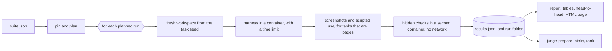

# Harness Bench

Does the coding harness matter, or only the model? Harness Bench runs the same tasks with the same models through different agent harnesses (Claude Code, Codex, Pi, oh-my-pi, OpenCode, Droid, Hermes) and reports pass rate, time, tokens and cost for each, with the statistics needed to tell a real difference from run-to-run noise.

> **Status (2026-10-05): no real harness has been measured yet.** Everything here has been exercised with a built-in fake agent, reference solutions and stored sample solutions, including inside Docker. The pages under `docs/demo/` show those and are labelled as such. The next step is one probe run per real harness. See [What is and is not verified](#what-is-and-is-not-verified).


Demo pages, all generated by the real pipeline from fake agents and stored sample solutions: [results](docs/demo/index.html), [results with a screenshot gallery](docs/demo/showcase/index.html), [blind judging](docs/demo/judging/index.html), [worked ranking](docs/demo/ranking.md).

## Why

Using one model in two harnesses often feels different: one finishes the job, the other wanders or burns tokens. A feeling is not a number, and a single side-by-side screenshot is one sample. This project asks the question properly:

- **Same model, same task, same limits.** Only the harness changes.
- **Repeats.** Every cell is run several times, and every number carries an interval.
- **Hidden checks.** Tasks are graded by tests the agent never sees, on behaviour the prompt states.
- **Cost that includes failures.** The headline figure is cost per passed run.
- **Eyes where tests run out.** Open-ended visual tasks are judged blind, side by side, and ranked.

## Two tracks

| Track | Tasks | Graded by | Best at separating |
|---|---|---|---|
| Core | 8 small projects: five JavaScript logic tasks (build from a spec, fix a bug, add a feature, refactor, thread a feature through six modules), two interactive pages graded by really using them, and one Python command-line tool | 12–22 hidden checks each | cheaper models and weaker harnesses |
| Visual | 1 open-ended scene: a real-time 3D pirate ship at sunset | automatic checks, then blind pairwise picks by people (and optionally a model) | strong models, which pass most tests |

Tasks are listed with their calibration results in [docs/tasks.md](docs/tasks.md).


Both attempts above pass every automatic check. So does a third in which no ship is visible at all. Telling them apart is what the judging page is for: it plays a short clip of each, hides which entry is which, and turns the picks into a ranking with intervals. (The entries shown are stored sample solutions, not harness results. [Worked example](docs/demo/ranking.md).)

## How a run works



- **Planner** (`core.py`): crosses tasks × models × modes × harnesses × repeats into seeded, shuffled blocks.
- **Adapters** (`adapters.py`): one per harness. How to launch it unattended and how to read its token and cost output.
- **Sandbox** (`sandbox.py`): a container per run; a local mode exists only for the fake agent.
- **Runner** (`runner.py`): workspace, launch, timeout, change size, evaluation, record. Resumable.
- **Capture** (`capture/capture.py`): drives headless Chromium over the DevTools protocol for stills, a clip, errors and requests. It can also use a page like a person, with real clicks, typing, key presses and reloads from a hidden script, so that a to-do app or a keyboard-accessible widget is graded on what it does.
- **Report** (`core.py`, `site.py`): Wilson intervals, an overall permutation test, head-to-head comparisons with calibrated intervals, per-task grid, the checks that fail most, a run explorer showing which hidden checks each run failed, and a screenshot gallery, in one HTML page.
- **Judging** (`judging.py`, `ranking.py`): blind pairs, a judging page, a model judge with side-swap control, Bradley–Terry ranking, Cohen's kappa.

Python 3.12 standard library only on your machine (3.11 is enough inside the container). Node 22 runs the JavaScript tasks' checks.

## Try it without any model

Fake agents of different "skill" go through the real pipeline, so you can see every report.

```sh
make test            # the test suite
make demo            # five scored tasks, four fake agents, two fake models: report and results page in runs/demo/
make demo-showcase   # the stored sample solutions for the visual tasks: screenshots and blind judging pages
```

Tasks that are pages (the visual tasks, `todo-app` and `tabs-keyboard`) need a Chromium-family browser: set `HB_BROWSER` to its executable. Without it their tests are skipped and `make demo-showcase` cannot capture. After `make demo-showcase`, continue with the commands in [docs/visual-track.md](docs/visual-track.md).

What `make demo` runs:

```sh
python3 -m harness_bench pin    --suite suites/demo-mock.json --output runs/demo/pinned.json --sandbox local
python3 -m harness_bench plan   --suite runs/demo/pinned.json --output runs/demo/plan.json
python3 -m harness_bench run    --plan runs/demo/plan.json --sandbox local
python3 -m harness_bench report --plan runs/demo/plan.json --results runs/<plan id>/results.jsonl --html runs/demo/index.html
```

## Run real harnesses

Real harnesses only run inside Docker; the runner refuses otherwise.

```sh
docker build -t harness-bench:latest docker/
python3 -m harness_bench check --suite suites/pilot-v1.json        # tasks, image, versions, logins; no model calls
python3 -m harness_bench pin   --suite suites/pilot-v1.json --output runs/pilot-pinned.json
python3 -m harness_bench plan  --suite runs/pilot-pinned.json --output runs/pilot-plan.json
python3 -m harness_bench run   --plan runs/pilot-plan.json --limit 1 --harness codex   # one cheap probe first
python3 -m harness_bench run   --plan runs/pilot-plan.json                              # the rest; safe to stop and resume
```

`suites/pilot-v1.json` is a draft with two harnesses and two models. Read its `notes` before running it.

### Logins

Login files named in `credentials` are copied into a throwaway home for each run and deleted afterwards, including when the run is interrupted. Two things follow, and `check` reminds you of both:

- **The agent can read the login.** Use one you are prepared to expose to whatever the model does.
- **A refresh made inside the container is thrown away by default.** Some logins replace their token on use, so your own copy can then stop working and you would have to log in again.

The clean way around both is a second login kept only for the benchmark: log in again with the harness's home pointed at a folder of its own, and name that file in `credentials`. Then set `"write_back_logins": true` on the harness, and a refreshed login is copied back to that file after each run, provided it is a plain, non-empty file of the same shape reached through no link, with the previous few versions kept beside it as `<name>.harness-bench-backup-<time>`. Write-back cannot tell a genuine refresh from content the agent chose to write, which is why it is off unless you ask for it.

If the runner is killed outright (`kill -9`, a crash, a power cut) it cannot clean up. `python3 -m harness_bench cleanup` removes leftover containers and throwaway homes.

### Grading work done elsewhere

Hosted agents such as Devin or Capy cannot be launched by the runner. Give one a task's `prompt.md` and `seed/` by hand, download what it produced, and grade the folder:

```sh
python3 -m harness_bench grade --task tasks/kanban-undo --workspace ~/Downloads/devin-kanban
```

## Suite format

```json
{
  "schema_version": 2, "suite_id": "my-suite", "comparison": "controlled",
  "seed": 1, "repetitions": 3,
  "budget": {"timeout_seconds": 900, "max_retries": 0},
  "models": [{"id": "cheap", "name": "provider-model-name", "reasoning_effort": "medium", "billing": "api",
              "harness_names": {"pi": "provider/model-name"},
              "harness_args": {"codex": ["-c", "model_provider=\"other\""]},
              "harness_env": {"claude": ["ANTHROPIC_BASE_URL=https://example.invalid"]},
              "price_per_mtok": {"input": 0.3, "cached_input": 0.03, "output": 1.2}}],
  "modes": [{"id": "single", "prompt_suffix": ""},
            {"id": "subagents", "prompt_suffix": "\n\nSplit the work across subagents."}],
  "tasks": [{"id": "kanban-undo", "spec": "tasks/kanban-undo", "seed_revision": null, "evaluator_revision": null}],
  "harnesses": [{"id": "codex", "adapter": "codex", "version": null,
                 "credentials": ["~/.codex/auth.json:.codex/auth.json"],
                 "env": ["SOME_API_KEY"], "args": [], "modes": ["single"], "models": ["cheap"]}]
}
```

| Field | Meaning |
|---|---|
| `models[].harness_names`, `harness_args`, `harness_env` | per-harness spelling of the model, extra arguments and environment, for when one model needs different provider settings in each harness |
| `models[].billing` | `subscription` keeps reported cost empty, because included usage is not an invoice |
| `models[].price_per_mtok` | optional price table (USD per million tokens) for the list-price estimate |
| `modes[].prompt_suffix` | text added to the task prompt in that mode, for example to ask for subagents |
| `harnesses[].env` | `NAME` passes a variable through from your shell; `NAME=value` sets a literal |
| `harnesses[].credentials` | `host file:path under the container home`; copied into a throwaway home that is deleted after the run |
| `harnesses[].write_back_logins` | `true` copies a login the harness refreshed back to its file afterwards; off by default (see Logins) |
| `harnesses[].modes`, `models`, `tasks` | limit a harness to what it can run |
| `seed_revision`, `evaluator_revision`, `version` | filled by `pin`; a run is blocked if they no longer match |

## Task format

```
tasks/<id>/task.json     evaluator command, time limit, optional capture settings
tasks/<id>/prompt.md     what the agent is told
tasks/<id>/seed/         starting workspace
tasks/<id>/evaluator/    hidden checks; never visible to the agent
tasks/<id>/reference/    a solution that must pass
tasks/<id>/variants/     optional other solutions: real flawed attempts the checks must keep catching, and samples for the visual demo
```

The evaluator writes `$HB_OUT/result.json` as `{"checks": [{"name": "...", "passed": true}]}`. `validate-tasks` proves the seed fails and the reference passes.

## What is and is not verified

| Part | State |
|---|---|
| Planning, reporting, comparison statistics, ranking | unit-tested |
| Runner, timeouts, resume, blocking on drift, hostile leftovers, interruption, login handling | tested end to end with the fake agent, outside Docker |
| Overall test and head-to-head verdict | calibrated by simulation: false alarms about 5% or less ([tables](docs/methodology.md#statistics)) |
| Claude Code adapter | usage parser checked against the real output of one trivial call, including its subagent count |
| Code review | three independent reviews (32 findings); all addressed, and every fix outside the Docker path has a test |
| All 11 tasks | seed fails and reference passes; the 10 real tasks were also attempted blind from the prompt alone, and each was passed at least once ([details](docs/tasks.md)) |
| Hidden checks | six tasks keep a real flawed attempt that the checks must fail in exactly the recorded way |
| Screenshot capture and scripted interaction | tested on macOS with a Chromium-based browser, with and without a GPU; the interaction grading agreed with independently written pages |
| Judging page, model judge, ranking | tested on stored sample solutions, with two model judges ([worked example](docs/demo/ranking.md)); no human picks collected yet |
| Docker sandbox and image | built and run on Docker Desktop for macOS (2026-10-05): the preflight check validated all nine suite tasks inside containers, browser tasks included, and the fake-agent suite ran through it with every outcome (pass, fail, timeout, crash) and left nothing behind. Not run on Linux |
| The other harness adapters | commands checked against each tool's `--help`; usage parsers tested on synthetic output only, **not on a live run** |
| Droid usage | no parser yet |
| Retries | `max_retries` is recorded but every run gets one attempt |

## Documents

- [Methodology](docs/methodology.md): design, metrics, statistics, threats to validity.
- [Tasks](docs/tasks.md): the task set and how it was calibrated.
- [Visual track](docs/visual-track.md): capture, blind judging, ranking.
- [Adding a harness](docs/adding-a-harness.md).
- [Writing up results](docs/writing-up-results.md): a template for reporting real runs honestly.
- [Protocol](docs/protocol.md) and [result records](docs/results.md).

Related work this builds on in spirit: SWE-bench (hidden tests on real repositories), Terminal-Bench (harness-by-model leaderboards) and Aider's polyglot benchmark. Harness Bench is much smaller and aims at a narrower question: for one person's budget, which harness gives the most passes per dollar with a given model, and is the gap real.
