# Ten coding harnesses, the same models, nine tasks

**Harness Bench, first pass**

Runs made 2026-10-07 to 2026-10-08 (UTC) · plan `7d7e5a45591c4afd` · 216 runs, one per harness, model and task

> **Read this first.** Every figure below comes from a single run per harness, model and task. The [limits](#what-this-does-not-show) are part of the result.

## Key findings

- **The harness did not change whether the work got done.** With gpt-6.1-sol at medium effort, all ten harnesses passed all nine tasks: 90 of 90 runs.
- **It changed the bill.** The same nine tasks took 19 to 40 minutes, 0.64M to 4.15M tokens and $0.75 to $1.57 at list price. Pi was the cheapest and the Codex app the fastest.
- **The fastest harness was the one that could look at its own work.** The Codex app has a browser tool built in and made its 3D page in 6.7 minutes; the Codex CLI, same model and same maker, took 13.8. The app also ran outside the sandbox, so part of that gap is the setting.
- **Passing the checks was not the same as being finished.** Every 3D page passed the automatic checks. Judged blind, side by side, five of the ten never lost a pair and two lost eight of nine.
- **A cheaper model cost time on the hard task, not the easy ones.** On DeepSeek's API the nine tasks cost less in every harness, about half for most (15% to 74% of the gpt-6.1-sol price), and the eight smaller tasks were as fast. But the 3D page took 15 to 60 minutes instead of 7 to 19. Two harnesses were still editing it when stopped at an hour.
- **One run each.** Every figure is a single run per harness, model and task. No difference in pass rate is statistically clear, and time and cost can move on a second attempt.

## Results at a glance

Time is for all nine tasks. Cost is tokens at one list price for every harness, an estimate and not a bill. Tokens are everything the harness reports, cached input included. The last column is the 3D task's blind judging: pairs won, tied and lost. Numbers beside a figure point to the notes under each table.

### gpt-6.1-sol, medium effort

| Harness | Passed | Time | Cost | Tokens | 3D task, W-T-L |
|---|---|---:|---|---:|---|
| Codex app¹ | 9 of 9 | 19 min | $1.29 | 3.15M | 5-4-0 |
| Pi | 9 of 9 | 23 min | $0.75 | 0.64M | 3-6-0 |
| DeepSeek Harness | 9 of 9 | 26 min² | $1.13 | 2.43M | 2-5-2 |
| Devin | 9 of 9 | 26 min³ | $1.57 | 4.15M | 5-4-0 |
| Codex CLI | 9 of 9 | 27 min | $1.11 | 2.09M | 2-3-4 |
| Capy¹ | 9 of 9 | 27 min | at least $1.83⁴ | —⁴ | 0-1-8 |
| OpenCode | 9 of 9 | 29 min | $1.06 | 1.60M | 2-2-5 |
| Droid | 9 of 9 | 30 min³ | $1.33 | 2.36M | 4-5-0 |
| Hermes Agent | 9 of 9 | 33 min | $1.41 | 2.95M | 0-1-8 |
| oh-my-pi | 9 of 9 | 40 min | $1.40 | 2.92M | 4-5-0 |

1. Run by hand in its desktop app on a Mac with a GPU, not in the sandbox. Compare its time with the other hand-run app, not with the command-line harnesses.
2. Timed to its final answer. Its command line then stayed open, idle, about five minutes before exiting; that wait is not counted.
3. The 3D task is a second attempt. The first was cut off at an earlier 15-minute limit while still working, and its tokens are not counted.
4. Capy reports dollars, not tokens. This is its own figure, with one task's share worked out from its usage total, so the true cost is this or a little more.

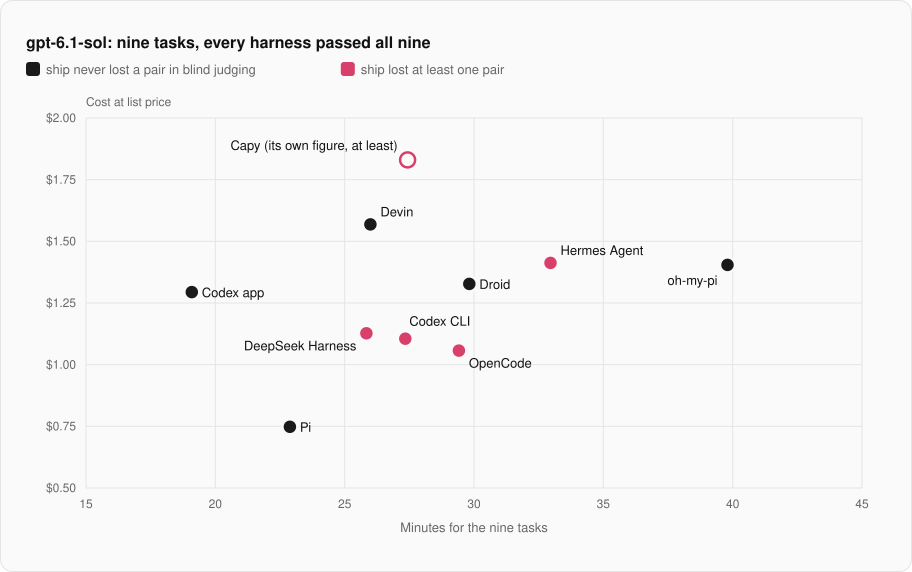

### DeepSeek, high effort

| Harness | Model through | Passed | Time | Cost | Tokens | 3D task, W-T-L |
|---|---|---|---:|---|---:|---|
| Pi | DeepSeek's API | 9 of 9 | 34 min | $0.36 | 12.69M | 2-3-1 |
| Hermes Agent | DeepSeek's API | 9 of 9 | 36 min | $0.61 | 25.09M | 0-0-6 |
| oh-my-pi | DeepSeek's API | 9 of 9 | 66 min | $0.81 | 28.76M | 2-3-1 |
| Codex CLI | DeepSeek's API | 9 of 9 | 66 min | $0.81 | 48.80M | 3-2-1 |
| OpenCode | DeepSeek's API | 8 of 9 | 21 min | $0.15¹ | 7.86M | 1-0-5 |
| Droid | DeepSeek's API | 8 of 9 | 68 min² | at least $0.13³ | 2.00M³ | 3-2-1 |
| DeepSeek Harness | DeepSeek's API | 8 of 9 | 70 min² | $0.64 | 30.78M | 4-2-0 |
| Devin | its own plan⁴ | 8 of 9 | 61 min | $1.84⁵ | 52.93M | —⁶ |
| Droid | its own plan⁴ | 7 of 9 | 70 min² | at least $0.27³ | 2.93M³ | —⁶ |

1. By far the shortest run on this model: OpenCode's 3D page took 15.5 minutes where the others took 26 to 60, so it used far fewer tokens than the other complete runs. That page was judged 6th of 7, and the run passed 8 of 9 tasks.
2. Still working on the 3D task when stopped at 60 minutes. The page it left passes every automatic check, but the run counts as not passed.
3. Droid reports usage only when a run ends, so its stopped 3D run has no tokens. Cost and tokens cover the other eight tasks.
4. The model as hosted by the harness's own plan. It is priced here at DeepSeek's API list price for comparison; on the plan it costs allowance, not dollars. The plan's model may not be the same as the API's.
5. Most of this is the 3D run, which sent 3.0M uncached input tokens.
6. Judged separately, as a single pair: Droid's page was picked over Devin's.

## The 3D task, judged blind

One task has no single right answer: a real-time 3D pirate ship at sunset, in one HTML file. Every page passed the ten automatic checks, so one person compared them side by side, 67 pairs in all, without knowing which harness made which. The rule was completeness first (gaps in the ship that the sea shows through), then a little weight for style.

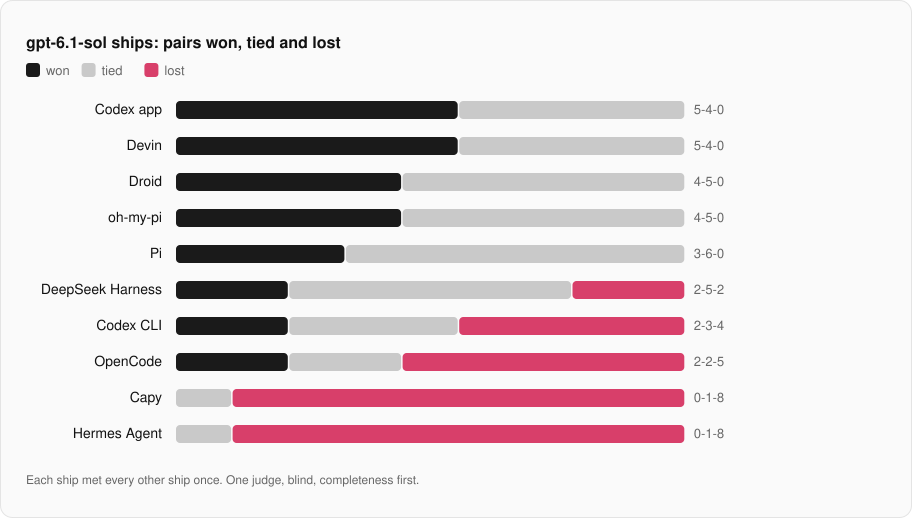

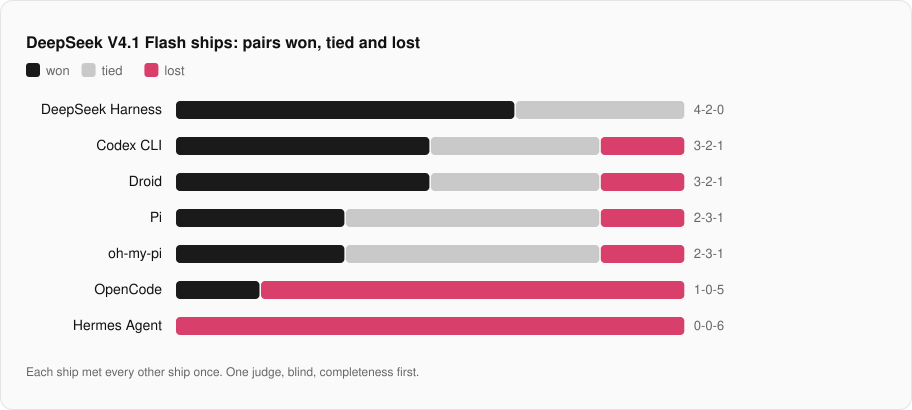

| | | |
|---|---|---|
| [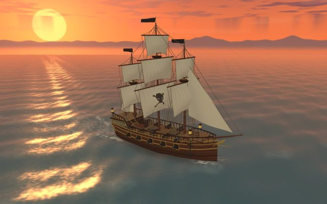](ships/gpt-6-1-sol.codex-app.html) Codex app · gpt-6.1-sol | [](ships/gpt-6-1-sol.devin.html) Devin · gpt-6.1-sol | [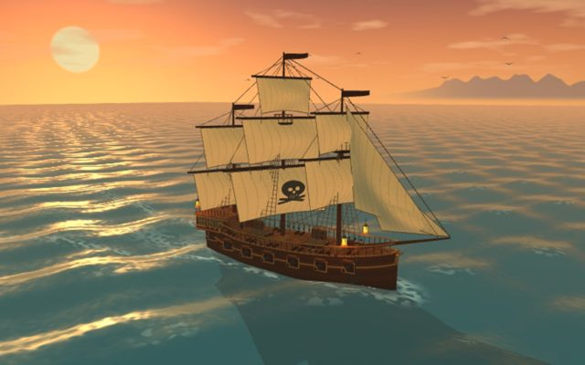](ships/gpt-6-1-sol.droid.html) Droid · gpt-6.1-sol |
| [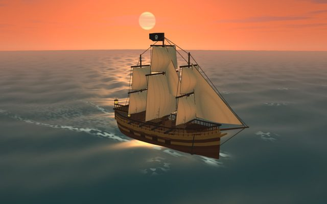](ships/gpt-6-1-sol.omp.html) oh-my-pi · gpt-6.1-sol | [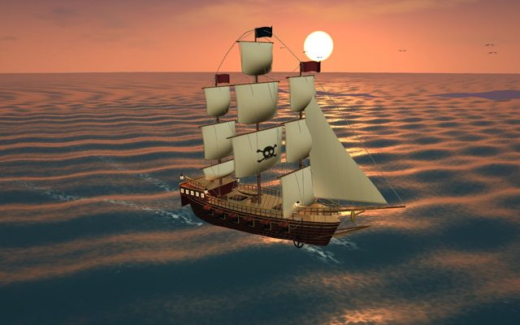](ships/gpt-6-1-sol.pi.html) Pi · gpt-6.1-sol | [](ships/gpt-6-1-sol.deepseek-harness.html) DeepSeek Harness · gpt-6.1-sol |
| [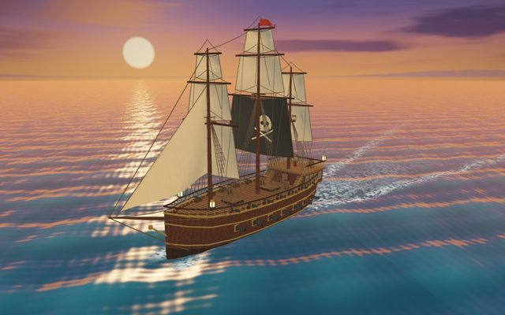](ships/gpt-6-1-sol.codex.html) Codex CLI · gpt-6.1-sol | [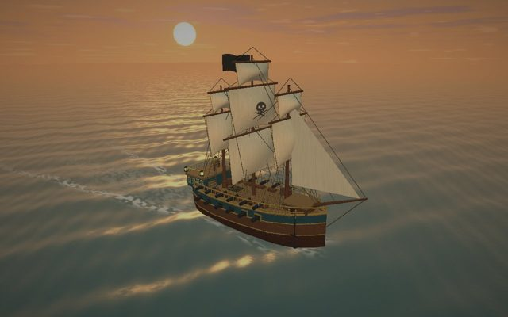](ships/gpt-6-1-sol.opencode.html) OpenCode · gpt-6.1-sol | [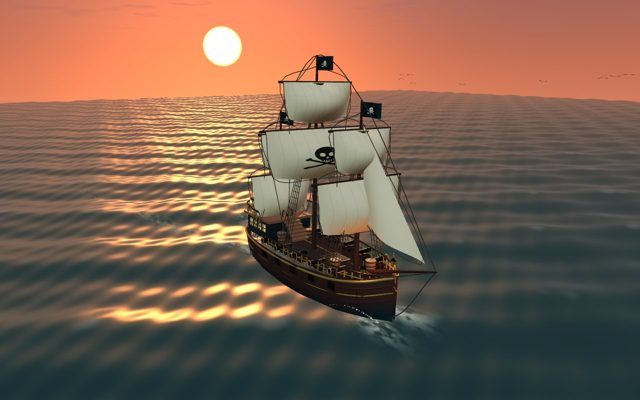](ships/gpt-6-1-sol.capy.html) Capy · gpt-6.1-sol |
| [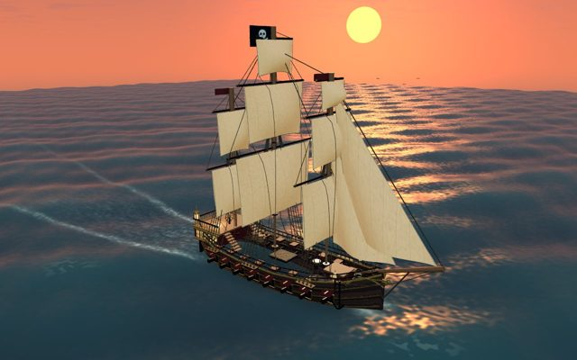](ships/gpt-6-1-sol.hermes.html) Hermes Agent · gpt-6.1-sol |  |  |

The ten gpt-6.1-sol pages, best-judged first. Each picture opens the page itself: drag to move the camera. [All 23 pages](ships/index.html), DeepSeek's included.

## Before quoting a number

- **One run per harness, model and task.** The plan has three repeats and one was run, so nothing here measures run-to-run variation.
- **Two settings.** The Codex app and Capy ran by hand on a Mac with a GPU. The other eight ran headless in a container without one. Compare times within a group.
- **Cost is an estimate** from tokens and one price list, not what anyone was billed. Runs on a subscription cost allowance, not dollars.
- **One judge** for the 3D task, and one page per harness and model.
- **Not in this pass:** Claude Code, Cursor and others; repeats two and three of the plan; any mode with subagents.
- **Made with an AI assistant.** The tasks, the benchmark and this write-up were produced with Claude Code, which is not among the harnesses compared.

The [full list of limits](#what-this-does-not-show) is further down. To explore: [interactive results](results/index.html) · [every ship, running](ships/index.html) · [data](https://github.com/Waveorwaves/harness-bench/tree/main/docs/first-pass/data).

The first two of those are HTML pages: GitHub shows their source. Open them from a clone (`docs/first-pass/index.html`) or through GitHub Pages if it is switched on for this repository.

## Setup

- **Suite and plan:** `suites/pilot-v1.json`, plan `7d7e5a45591c4afd`. The plan holds 612 runs (three repeats); this is the first repeat, 216 runs.
- **Tasks:** nine, each started from the same folder with the same prompt. Eight are graded only by hidden checks; one is also judged by eye.
- **Time limit:** 60 minutes per run, as a safety stop. The first 130 runs were made under a 15-minute limit; those that finished by themselves were kept, since a harness is never told the limit.
- **Sandbox:** each command-line run in its own Docker container (image `harness-bench:latest`, Linux, 2 CPUs, 4 GB, no GPU, network on) with a fresh home directory and only that harness's login copied in.
- **Host:** Apple M1 Pro, 16 GB, macOS 15.7, Docker Desktop 29.8.
- **By hand:** the Codex app and Capy have no unattended mode. Each task was pasted into a new chat in a fresh copy of the task folder on the Mac, and the result graded by the same checks.
- **Grading:** hidden checks the harness never sees. A run passes only if every check passes.
- **Cost:** tokens multiplied by one price list for every harness. It is an estimate for comparison, not a bill: runs on a subscription cost allowance, not dollars.

### Harnesses

| Harness | Version | Where it ran | Started with |
|---|---|---|---|
| Codex CLI | `codex-cli 0.160.1` | sandbox | `codex exec --json --ephemeral --dangerously-bypass-approvals-and-sandbox` |
| Pi | `1.0.4` | sandbox | `pi -p --mode json --no-session` |
| oh-my-pi | `omp/18.6.1` | sandbox | `omp -p --mode json --no-session --auto-approve` |
| OpenCode | `1.18.34` | sandbox | `opencode run --format json --auto` |
| Hermes Agent | `Hermes Agent v0.21.5+7566.g3dadeb9 (2026.9.24) · upstream 3dadeb92` | sandbox | `hermes -z` |
| Devin | `devin 3000.11.3 (9c803229faa4)` | sandbox | `devin -p --permission-mode dangerous --respect-workspace-trust false` |
| Droid | `0.235.0` | sandbox | `droid exec -o json --skip-permissions-unsafe` |
| Codex app | `ChatGPT desktop 26.928.20755 (codex-cli 0.159.0)` | by hand, on the Mac | the app as installed, with the user's own configuration; one new chat per task |
| Capy | `Capy desktop 0.4.2` | by hand, on the Mac | the app as installed; one new chat per task |
| DeepSeek Harness | `0.2.0-rc.2` | sandbox | `dsh --profile headless --json` with `DSH_PERMISSION_MODE=danger-full-access`; gpt-6.1-sol declared in its settings |

### Models

| Setting | Model names passed | Effort asked for | Paid through | Harnesses |
|---|---|---|---|---|
| gpt-6.1-sol, medium effort | `gpt-6-1-sol-medium`, `gpt-6.1-sol`, `openai-codex/gpt-6.1-sol`, `openai/gpt-6.1-sol` | medium | ChatGPT/Codex subscription; Devin plan (Devin); Factory plan (Droid) | Codex CLI, Pi, oh-my-pi, OpenCode, Hermes Agent, Devin, Droid, Codex app, Capy, DeepSeek Harness |
| DeepSeek's API, "medium" asked for (superseded) | `deepseek-flash`, `deepseek/deepseek-flash` | medium | DeepSeek API key | Codex CLI, Pi, oh-my-pi, OpenCode, Hermes Agent |
| DeepSeek's API, high effort | `custom:deepseek-flash-0`, `deepseek-flash`, `deepseek-official/deepseek-flash`, `deepseek/deepseek-flash` | high | DeepSeek API key | Codex CLI, Pi, oh-my-pi, OpenCode, Hermes Agent, Droid, DeepSeek Harness |
| DeepSeek V4.1 Flash as hosted by the harness's plan, high effort | `deepseek-v4-1-flash-high`, `deepseek-v4.1-flash` | high | Devin plan (Devin); Factory plan (Droid) | Devin, Droid |

All subscriptions were the $20 tier of each plan. Effort is what each harness was asked for; it could not be confirmed from the results.

### Tasks

| Task | Kind | What the agent must do | Hidden checks |
|---|---|---|---:|
| `md-preview` | build from a spec | Write a Markdown-subset renderer and a preview page to an exact specification | 18 |
| `kanban-undo` | bug fix | Fix two reported undo/redo faults in a small kanban board | 14 |
| `expenses-csv` | feature | Add CSV export and import to an expense tracker | 17 |
| `checkout-refactor` | refactor | Split one long pricing function into four modules without changing any result | 12 |
| `bookmarks-tags` | feature across modules | Add tags through validation, storage with a migration, search, import/export and view | 20 |
| `todo-app` | interactive page | Build a to-do list page, graded by really using it in a headless browser | 22 |
| `tabs-keyboard` | accessibility fix | Make a tabs widget work with the keyboard and screen readers, including a nested widget | 19 |
| `log-report` | Python command-line feature | Add bad-line handling, a time window, percentiles and JSON output to a log summariser | 16 |
| `pirate-ship-3d` | open-ended 3D page | One `index.html`: a real-time WebGL pirate ship on a moving ocean at sunset | 10 |

Prompts, seeds, checks and reference solutions are in [`tasks/`](https://github.com/Waveorwaves/harness-bench/tree/main/tasks).

### Price list

| Model | Input | Cached input | Cache write | Output |
|---|---:|---:|---:|---:|
| `gpt-6.1-sol` | $2 | $0.1 | $2.5 | $10 |
| `deepseek-flash` | $0.3 | $0.006 | $0 | $1.2 |

US dollars per million tokens, taken from the model catalogue shipped with Pi 1.0.4. For gpt-6.1-sol it reproduces, to the cent, the cost a second tool (CodexBar) computes from the Codex app's own logs. It has not been checked against the providers' price pages.

## Detailed results

The same results in full, in the order of this project's [write-up template](https://github.com/Waveorwaves/harness-bench/blob/main/docs/writing-up-results.md).

### 1. Is there any difference in pass rate?

| Model setting | Harnesses | Best minus worst pass rate | p-value |
|---|---:|---:|---:|
| gpt-6.1-sol, medium effort | 10 | 0 points | 1.000 |
| DeepSeek's API, "medium" asked for (superseded) | 5 | 0 points | 1.000 |
| DeepSeek's API, high effort | 7 | 11 points | 1.000 |
| DeepSeek V4.1 Flash as hosted by the harness's plan, high effort | 2 | 11 points | 1.000 |

No. A permutation test per model (outcomes shuffled among harnesses within each task) finds nothing: every p-value is 1. Of 77 head-to-head comparisons on the same model, 0 are clear. Everything after this point is about time, cost and the look of one task, not about which harness is more often right.

### 2. Pass rate with intervals

| Harness | gpt-6.1-sol | DeepSeek API, high | DeepSeek on its plan |
|---|---|---|---|
| Codex app | 9 of 9 | not run | not run |
| Pi | 9 of 9 | 9 of 9 | not run |
| DeepSeek Harness | 9 of 9 | 8 of 9 | not run |
| Devin | 9 of 9 | not run | 8 of 9 |
| Codex CLI | 9 of 9 | 9 of 9 | not run |
| Capy | 9 of 9 | not run | not run |
| OpenCode | 9 of 9 | 8 of 9 | not run |
| Droid | 9 of 9 | 8 of 9 | 7 of 9 |
| Hermes Agent | 9 of 9 | 9 of 9 | not run |
| oh-my-pi | 9 of 9 | 9 of 9 | not run |

With nine runs each of these is a wide range, not a point. The 95% intervals (Wilson): 9 of 9 is 70% to 100%; 8 of 9 is 56% to 98%; 7 of 9 is 45% to 94%.

### 3. gpt-6.1-sol, medium effort

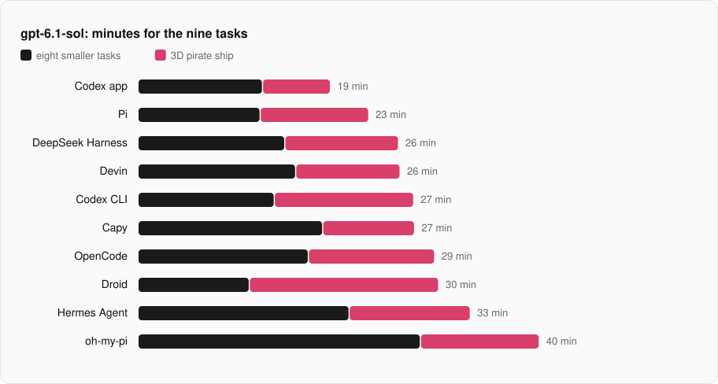

| Harness | Passed | All nine | Eight smaller | Ship | Median task | Cost | Per pass | Ship W-T-L |
|---|---|---:|---:|---:|---:|---|---:|---|
| Codex app | 9 of 9 | 19.1 min | 12.4 min | 6.7 min | 89 s | $1.29 | $0.144 | 5-4-0 |
| Pi | 9 of 9 | 22.9 min | 12.1 min | 10.8 min | 83 s | $0.75 | $0.083 | 3-6-0 |
| DeepSeek Harness | 9 of 9 | 25.8 min | 14.6 min | 11.3 min | 115 s | $1.13 | $0.125 | 2-5-2 |
| Devin | 9 of 9 | 26.0 min | 15.6 min | 10.4 min | 123 s | $1.57 | $0.174 | 5-4-0 |
| Codex CLI | 9 of 9 | 27.3 min | 13.5 min | 13.8 min | 97 s | $1.11 | $0.123 | 2-3-4 |
| Capy | 9 of 9 | 27.4 min | 18.3 min | 9.1 min | 152 s | at least $1.83 (own figure) | unknown | 0-1-8 |
| OpenCode | 9 of 9 | 29.4 min | 16.9 min | 12.5 min | 114 s | $1.06 | $0.117 | 2-2-5 |
| Droid | 9 of 9 | 29.8 min | 11.0 min | 18.8 min | 78 s | $1.33 | $0.147 | 4-5-0 |
| Hermes Agent | 9 of 9 | 33.0 min | 20.9 min | 12.0 min | 168 s | $1.41 | $0.157 | 0-1-8 |
| oh-my-pi | 9 of 9 | 39.8 min | 28.0 min | 11.8 min | 239 s | $1.40 | $0.156 | 4-5-0 |

Time is for all nine tasks, then split into the eight smaller ones and the pirate ship. Cost is at list price; per pass divides it by the tasks passed. The last column is the ship's blind judging: pairs won, tied and lost.

| Harness | Uncached input | Cached input | Output | All tokens | Model calls | Tool calls |
|---|---:|---:|---:|---:|---:|---:|
| Codex app | 0.25M | 2.85M | 0.05M | 3.15M | — | 72 |
| Pi | 0.15M | 0.45M | 0.04M | 0.64M | 86 | 118 |
| DeepSeek Harness | 0.20M | 2.17M | 0.05M | 2.43M | 170 | 202 |
| Devin | 0.26M | 3.82M | 0.07M | 4.15M | 171 | 274 |
| Codex CLI | 0.18M | 1.85M | 0.06M | 2.09M | — | 75 |
| Capy | — | — | — | — | — | — |
| OpenCode | 0.20M | 1.34M | 0.05M | 1.60M | 127 | 169 |
| Droid | 0.24M | 2.06M | 0.06M | 2.36M | 99 | — |
| Hermes Agent | 0.32M | 2.58M | 0.05M | 2.95M | 108 | — |
| oh-my-pi | 0.30M | 2.56M | 0.05M | 2.92M | 179 | 240 |

Tokens and steps are each harness's own report for the nine tasks. A dash means the harness does not report that figure; "8 of 9" means one run's figure is missing.

- **Fastest:** Codex app, 19.1 min. Its pirate ship took 6.7 min; the Codex CLI, with the same model from the same company, took 13.8 min. The app has a browser tool built in. In the sandbox the CLI had none: it installed Playwright to take screenshots and wrote its own image reader to inspect them.
- **Cheapest:** Pi, $0.75 and 0.64M tokens. Devin used 4.15M tokens on the same nine tasks.
- **Slowest:** oh-my-pi, 39.8 min, with 179 model calls against Pi's 86.
- **Droid** was the quickest on the eight smaller tasks (11.0 min) and the slowest on the ship (18.8 min).
- **Capy** reports no tokens per run. Its cost is the dollar figure on its own usage page.
- **DeepSeek Harness** is timed to its final answer. Its command line then stayed open about five minutes before exiting; that wait is kept in the data as `process_seconds`.

### 4. DeepSeek's API, high effort

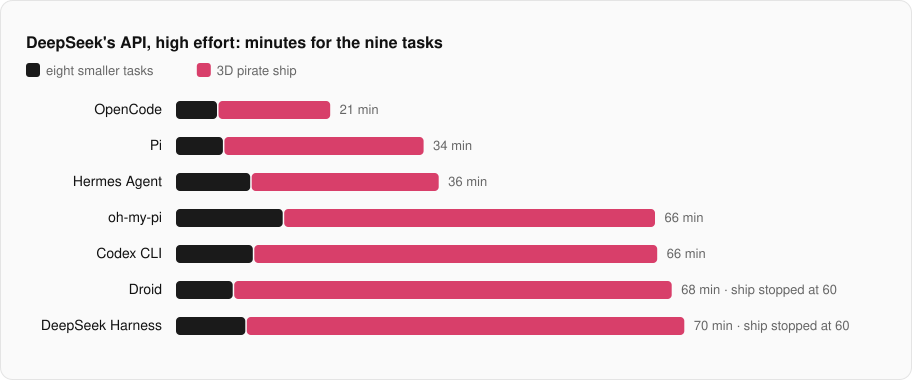

| Harness | Passed | All nine | Eight smaller | Ship | Median task | Cost | Per pass | Ship W-T-L |
|---|---|---:|---:|---:|---:|---|---:|---|
| Pi | 9 of 9 | 34.0 min | 6.6 min | 27.4 min | 51 s | $0.36 | $0.040 | 2-3-1 |
| Hermes Agent | 9 of 9 | 36.1 min | 10.3 min | 25.8 min | 78 s | $0.61 | $0.067 | 0-0-6 |
| oh-my-pi | 9 of 9 | 65.7 min | 14.8 min | 50.9 min | 64 s | $0.81 | $0.090 | 2-3-1 |
| Codex CLI | 9 of 9 | 66.0 min | 10.7 min | 55.3 min | 76 s | $0.81 | $0.091 | 3-2-1 |
| OpenCode | 8 of 9 | 21.3 min | 5.8 min | 15.5 min | 40 s | $0.15 | $0.019 | 1-0-5 |
| Droid | 8 of 9 | 68.0 min | 8.0 min | stopped at 60 min | 58 s | at least $0.13 (8 of 9 priced) | unknown | 3-2-1 |
| DeepSeek Harness | 8 of 9 | 69.7 min | 9.7 min | stopped at 60 min | 82 s | $0.64 | $0.079 | 4-2-0 |

| Harness | Uncached input | Cached input | Output | All tokens | Model calls | Tool calls |
|---|---:|---:|---:|---:|---:|---:|
| Pi | 0.07M | 12.40M | 0.22M | 12.69M | 203 | 255 |
| Hermes Agent | 0.25M | 24.51M | 0.32M | 25.09M | 194 | — |
| oh-my-pi | 0.63M | 27.75M | 0.38M | 28.76M | 251 | 286 |
| Codex CLI | 0.33M | 48.12M | 0.36M | 48.80M | — | 256 |
| OpenCode | 0.07M | 7.72M | 0.07M | 7.86M | 162 | 230 |
| Droid | 0.05M (8 of 9) | 1.86M (8 of 9) | 0.09M (8 of 9) | 2.00M (8 of 9) | 100 (8 of 9) | — |
| DeepSeek Harness | 0.12M | 30.31M | 0.35M | 30.78M | 257 | 327 |

- **Cheaper in every harness.** Pi $0.36 against $0.75; Hermes Agent $0.61 against $1.41; oh-my-pi $0.81 against $1.40; Codex CLI $0.81 against $1.11; OpenCode $0.15 against $1.06; DeepSeek Harness $0.64 against $1.13.
- **The extra time is the ship.** The eight smaller tasks took 6 to 15 minutes in total, against 11 to 28 on gpt-6.1-sol.
- **Two runs never stopped by themselves.** Droid and DeepSeek Harness were still editing their ships at the 60-minute stop. The pages they left pass every automatic check.
- **Far more tokens, mostly cached.** Long runs re-read their own history on every call.

### 5. DeepSeek V4.1 Flash as hosted by a plan

| Harness | Passed | All nine | Eight smaller | Ship | Median task | Cost | Per pass |
|---|---|---:|---:|---:|---:|---|---:|
| Devin | 8 of 9 | 61.4 min | 5.5 min | 56.0 min | 39 s | $1.84 | $0.230 |
| Droid | 7 of 9 | 69.8 min | 9.8 min | stopped at 60 min | 77 s | at least $0.27 (8 of 9 priced) | unknown |

| Harness | Uncached input | Cached input | Output | All tokens | Model calls | Tool calls |
|---|---:|---:|---:|---:|---:|---:|
| Devin | 3.58M | 48.96M | 0.39M | 52.93M | 326 | 369 |
| Droid | 0.38M (8 of 9) | 2.43M (8 of 9) | 0.12M (8 of 9) | 2.93M (8 of 9) | 123 (8 of 9) | — |

Only Devin and Droid offer this route. Droid also ran on DeepSeek's own API (section 4): 8 of 9 there, 7 of 9 here. The plans' model and the API's `deepseek-flash` may not be the same model.

### 6. By task

Seconds per task, with the tasks in the order of the task table above. ✗ marks a failed check and ■ a run stopped at the time limit.

#### gpt-6.1-sol

| Harness | md | kanban | expenses | checkout | bookmarks | todo | tabs | log | ship |
|---|---:|---:|---:|---:|---:|---:|---:|---:|---:|
| Codex app | 82 | 42 | 73 | 89 | 137 | 142 | 78 | 99 | 404 |
| Pi | 83 | 58 | 95 | 81 | 122 | 78 | 77 | 132 | 646 |
| DeepSeek Harness | 74 | 58 | 168 | 64 | 115 | 128 | 74 | 192 | 677 |
| Devin | 122 | 75 | 105 | 87 | 123 | 170 | 130 | 127 | 621 |
| Codex CLI | 85 | 55 | 110 | 72 | 97 | 170 | 83 | 138 | 830 |
| Capy | 152 | 79 | 110 | 144 | 167 | 128 | 167 | 152 | 547 |
| OpenCode | 102 | 76 | 114 | 95 | 141 | 230 | 113 | 141 | 752 |
| Droid | 69 | 46 | 95 | 67 | 78 | 142 | 66 | 98 | 1127 |
| Hermes Agent | 101 | 124 | 162 | 173 | 247 | 176 | 105 | 168 | 721 |
| oh-my-pi | 239 | 101 | 127 | 100 | 311 | 354 | 270 | 177 | 708 |

#### DeepSeek's API, high effort

| Harness | md | kanban | expenses | checkout | bookmarks | todo | tabs | log | ship |
|---|---:|---:|---:|---:|---:|---:|---:|---:|---:|
| Pi | 39 | 19 | 56 | 31 | 51 | 41 | 94 | 65 | 1646 |
| Hermes Agent | 98 | 41 | 68 | 57 | 95 | 106 | 78 | 76 | 1546 |
| oh-my-pi | 178 | 21 | 45 | 26 | 63 | 312 | 176 | 64 | 3053 |
| Codex CLI | 76 | 23 | 48 | 35 | 43 | 237 | 76 | 104 | 3316 |
| OpenCode | 31 | 20 | 37 | 40 | 60 | 37 | 62 | 62 ✗ | 928 |
| Droid | 60 | 31 | 44 | 29 | 50 | 109 | 98 | 58 | 3600 ■ |
| DeepSeek Harness | 71 | 22 | 82 | 31 | 82 | 83 | 113 | 96 | 3600 ■ |

**Cost per task, and the plan-hosted rows**

Dollars per task at list price. `*` marks a harness's own figure and `?` an unknown cost.

#### gpt-6.1-sol: cost per task

| Harness | md | kanban | expenses | checkout | bookmarks | todo | tabs | log | ship |
|---|---:|---:|---:|---:|---:|---:|---:|---:|---:|
| Codex app | 0.077 | 0.059 | 0.096 | 0.093 | 0.112 | 0.246 | 0.125 | 0.105 | 0.381 |
| Pi | 0.052 | 0.043 | 0.054 | 0.054 | 0.083 | 0.054 | 0.045 | 0.076 | 0.287 |
| DeepSeek Harness | 0.077 | 0.066 | 0.094 | 0.050 | 0.120 | 0.105 | 0.059 | 0.138 | 0.417 |
| Devin | 0.108 | 0.118 | 0.114 | 0.105 | 0.162 | 0.171 | 0.121 | 0.152 | 0.517 |
| Codex CLI | 0.059 | 0.049 | 0.069 | 0.054 | 0.073 | 0.105 | 0.074 | 0.099 | 0.522 |
| Capy | 0.25* | 0.14* | 0.15* | 0.11* | 0.22* | 0.20* | 0.23* | 0.11* | 0.42* |
| OpenCode | 0.079 | 0.070 | 0.081 | 0.060 | 0.110 | 0.159 | 0.060 | 0.110 | 0.328 |
| Droid | 0.062 | 0.049 | 0.080 | 0.066 | 0.077 | 0.134 | 0.073 | 0.089 | 0.699 |
| Hermes Agent | 0.082 | 0.118 | 0.141 | 0.122 | 0.122 | 0.134 | 0.121 | 0.161 | 0.411 |
| oh-my-pi | 0.097 | 0.121 | 0.112 | 0.092 | 0.176 | 0.189 | 0.153 | 0.158 | 0.306 |

#### DeepSeek's API, high effort: cost per task

| Harness | md | kanban | expenses | checkout | bookmarks | todo | tabs | log | ship |
|---|---:|---:|---:|---:|---:|---:|---:|---:|---:|
| Pi | 0.011 | 0.006 | 0.017 | 0.009 | 0.018 | 0.011 | 0.023 | 0.019 | 0.245 |
| Hermes Agent | 0.020 | 0.011 | 0.020 | 0.015 | 0.021 | 0.024 | 0.018 | 0.026 | 0.450 |
| oh-my-pi | 0.023 | 0.008 | 0.013 | 0.009 | 0.021 | 0.053 | 0.022 | 0.022 | 0.639 |
| Codex CLI | 0.029 | 0.033 | 0.017 | 0.013 | 0.017 | 0.075 | 0.026 | 0.039 | 0.565 |
| OpenCode | 0.003 | 0.006 | 0.005 | 0.008 | 0.011 | 0.006 | 0.007 | 0.010 | 0.098 |
| Droid | 0.016 | 0.008 | 0.012 | 0.007 | 0.015 | 0.026 | 0.025 | 0.018 | ? |
| DeepSeek Harness | 0.021 | 0.009 | 0.025 | 0.009 | 0.028 | 0.023 | 0.030 | 0.031 | 0.461 |

#### Plan-hosted DeepSeek: seconds per task

| Harness | md | kanban | expenses | checkout | bookmarks | todo | tabs | log | ship |
|---|---:|---:|---:|---:|---:|---:|---:|---:|---:|
| Devin | 25 | 22 | 29 | 28 | 39 | 84 ✗ | 46 | 57 | 3357 |
| Droid | 77 | 24 | 53 ✗ | 36 | 57 | 156 | 86 | 99 | 3601 ■ |

On gpt-6.1-sol the pirate ship is 42% of all time spent; on DeepSeek's API it is 82%. One task drives most of the time differences.

### 7. What tripped them up

| Harness | Model setting | Task | Checks passed | The check that failed, or why the run did not pass |
|---|---|---|---|---|
| OpenCode | DeepSeek's API, high effort | `log-report` | 15 of 16 | an unreadable --since or --until ends with exit code 2 |
| Droid | DeepSeek's API, high effort | `pirate-ship-3d` | 10 of 10 | still working when stopped at 60 minutes; the page as left passes 10 of 10 checks |
| DeepSeek Harness | DeepSeek's API, high effort | `pirate-ship-3d` | 10 of 10 | still working when stopped at 60 minutes; the page as left passes 10 of 10 checks |
| Devin | DeepSeek V4.1 Flash as hosted by the harness's plan, high effort | `todo-app` | 20 of 22 | the Active filter shows only to-dos that are not done; the Done filter shows only done to-dos |
| Droid | DeepSeek V4.1 Flash as hosted by the harness's plan, high effort | `expenses-csv` | 16 of 17 | export then import returns the same expenses |
| Droid | DeepSeek V4.1 Flash as hosted by the harness's plan, high effort | `pirate-ship-3d` | 10 of 10 | still working when stopped at 60 minutes; the page as left passes 10 of 10 checks |

Every run that did not pass is on a DeepSeek route. Three runs failed four checks between them. Each failed check tests one behaviour the prompt states, and each was failed by one harness only on that model setting.

### 8. Blocked and ungraded runs

None remain. During the runs one OpenCode run was refused by a subscription usage limit and was run again after the limit reset. Two gpt-6.1-sol ship runs (Devin, Droid) were first cut off at the earlier 15-minute limit and were made again without it; each is a fresh attempt, not a continuation. Capy's `log-report` run stalled at a prompt asking for access outside the task folder, changed nothing, and was run again in a new chat.

### 9. The pirate ship, judged by eye

Every page that was judged passes all ten automatic checks, so looks were judged separately. One person (the author) compared pages side by side, 67 pairs in all, without being told which harness made which. Both pages ran live so the camera could be moved. The judge's rule: completeness first (gaps in the ship through which the sea shows), "about the same" when both are complete, and a small weight for style. 24 of the 67 picks were ties.

#### gpt-6.1-sol: 45 pairs

| Rank | Harness | Won | Tied | Lost | Rating | 95% interval | Ship time | Ship cost |
|---:|---|---:|---:|---:|---:|---|---:|---:|
| 1= | Codex app | 5 | 4 | 0 | 1742 | 1658 to 1832 | 6.7 min | $0.38 |
| 1= | Devin | 5 | 4 | 0 | 1742 | 1663 to 1845 | 10.4 min | $0.52 |
| 3= | Droid | 4 | 5 | 0 | 1696 | 1607 to 1771 | 18.8 min | $0.70 |
| 3= | oh-my-pi | 4 | 5 | 0 | 1696 | 1619 to 1767 | 11.8 min | $0.31 |
| 5 | Pi | 3 | 6 | 0 | 1652 | 1558 to 1733 | 10.8 min | $0.29 |
| 6 | DeepSeek Harness | 2 | 5 | 2 | 1524 | 1410 to 1629 | 11.3 min | $0.42 |
| 7 | Codex CLI | 2 | 3 | 4 | 1435 | 1314 to 1542 | 13.8 min | $0.52 |
| 8 | OpenCode | 2 | 2 | 5 | 1387 | 1262 to 1484 | 12.5 min | $0.33 |
| 9= | Capy | 0 | 1 | 8 | 1064 | 981 to 1200 | 9.1 min | $0.42 (own figure) |
| 9= | Hermes Agent | 0 | 1 | 8 | 1064 | 980 to 1199 | 12.0 min | $0.41 |

**Who beat whom on gpt-6.1-sol**

Each row against each column: W won, T tied, L lost.

| Harness | Codex app | Devin | Droid | oh-my-pi | Pi | DeepSeek Harness | Codex CLI | OpenCode | Capy | Hermes Agent |
|---|---|---|---|---|---|---|---|---|---|---|
| Codex app | · | T | T | T | T | W | W | W | W | W |
| Devin | T | · | T | T | T | W | W | W | W | W |
| Droid | T | T | · | T | T | T | W | W | W | W |
| oh-my-pi | T | T | T | · | T | T | W | W | W | W |
| Pi | T | T | T | T | · | T | T | W | W | W |
| DeepSeek Harness | L | L | T | T | T | · | T | T | W | W |
| Codex CLI | L | L | L | L | T | T | · | T | W | W |
| OpenCode | L | L | L | L | L | T | T | · | W | W |
| Capy | L | L | L | L | L | L | L | L | · | T |
| Hermes Agent | L | L | L | L | L | L | L | L | T | · |

#### DeepSeek's API, high effort: 21 pairs

| Rank | Harness | Won | Tied | Lost | Rating | 95% interval | Ship time | Ship cost |
|---:|---|---:|---:|---:|---:|---|---:|---:|
| 1 | DeepSeek Harness | 4 | 2 | 0 | 1754 | 1572 to 1980 | stopped at 60 min | $0.46 |
| 2= | Codex CLI | 3 | 2 | 1 | 1633 | 1480 to 1793 | 55.3 min | $0.57 |
| 2= | Droid | 3 | 2 | 1 | 1633 | 1469 to 1800 | stopped at 60 min | unknown |
| 4= | Pi | 2 | 3 | 1 | 1578 | 1423 to 1710 | 27.4 min | $0.24 |
| 4= | oh-my-pi | 2 | 3 | 1 | 1578 | 1420 to 1706 | 50.9 min | $0.64 |
| 6 | OpenCode | 1 | 0 | 5 | 1262 | 1089 to 1423 | 15.5 min | $0.10 |
| 7 | Hermes Agent | 0 | 0 | 6 | 1063 | 955 to 1291 | 25.8 min | $0.45 |

**Who beat whom on DeepSeek's API, high effort**

Each row against each column: W won, T tied, L lost.

| Harness | DeepSeek Harness | Codex CLI | Droid | Pi | oh-my-pi | OpenCode | Hermes Agent |
|---|---|---|---|---|---|---|---|
| DeepSeek Harness | · | W | W | T | T | W | W |
| Codex CLI | L | · | T | T | W | W | W |
| Droid | L | T | · | W | T | W | W |
| Pi | T | T | L | · | T | W | W |
| oh-my-pi | T | L | T | T | · | W | W |
| OpenCode | L | L | L | L | L | · | W |
| Hermes Agent | L | L | L | L | L | L | · |

#### Plan-hosted DeepSeek: 1 pair

Droid's page was picked over Devin's. The judge's note: the other had the better style but a hole at the back of the ship.

- **Ratings** are Bradley-Terry strengths on an Elo-style scale (1500 is average). Intervals come from resampling the picks; where they overlap the order is not settled.
- **On gpt-6.1-sol** the five pages that never lost (Codex app, Devin, Droid, oh-my-pi, Pi) cannot be told apart. Capy's and Hermes Agent's are clearly below the rest.
- **On DeepSeek** the top five overlap; OpenCode's and Hermes Agent's are clearly below. The two top-ranked pages come from runs that were stopped at 60 minutes, so they had the most time.
- **No second judge**, so there is no measure of agreement. A model judge was not used.

#### Every ship

| | | |
|---|---|---|
| [](ships/gpt-6-1-sol.capy.html) Capy · gpt-6.1-sol | [](ships/gpt-6-1-sol.codex.html) Codex CLI · gpt-6.1-sol | [](ships/gpt-6-1-sol.codex-app.html) Codex app · gpt-6.1-sol |
| [](ships/gpt-6-1-sol.deepseek-harness.html) DeepSeek Harness · gpt-6.1-sol | [](ships/gpt-6-1-sol.devin.html) Devin · gpt-6.1-sol | [](ships/gpt-6-1-sol.droid.html) Droid · gpt-6.1-sol |
| [](ships/gpt-6-1-sol.hermes.html) Hermes Agent · gpt-6.1-sol | [](ships/gpt-6-1-sol.opencode.html) OpenCode · gpt-6.1-sol | [](ships/gpt-6-1-sol.pi.html) Pi · gpt-6.1-sol |
| [](ships/gpt-6-1-sol.omp.html) oh-my-pi · gpt-6.1-sol | [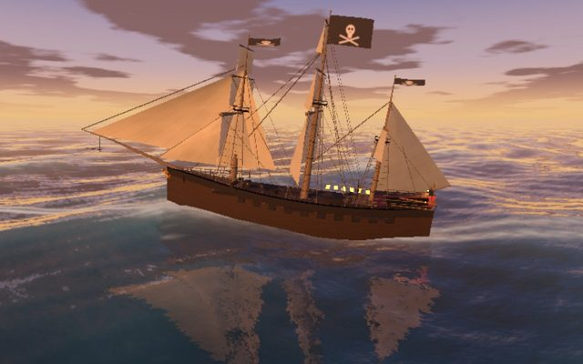](ships/deepseek-flash-high.codex.html) Codex CLI · DeepSeek API, high | [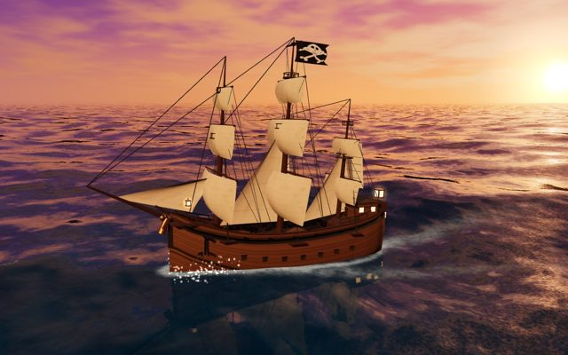](ships/deepseek-flash-high.deepseek-harness.html) DeepSeek Harness · DeepSeek API, high (stopped at 60 min) |
| [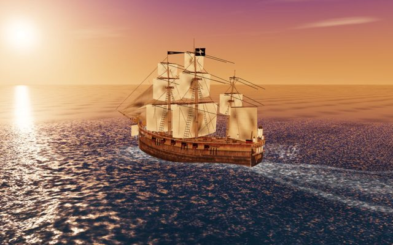](ships/deepseek-flash-high.droid.html) Droid · DeepSeek API, high (stopped at 60 min) | [](ships/deepseek-flash-high.hermes.html) Hermes Agent · DeepSeek API, high | [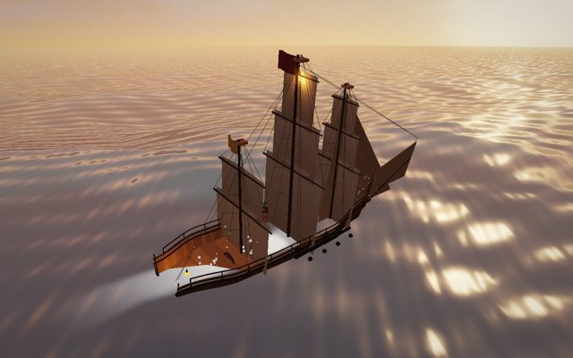](ships/deepseek-flash-high.opencode.html) OpenCode · DeepSeek API, high |
| [](ships/deepseek-flash-high.pi.html) Pi · DeepSeek API, high | [](ships/deepseek-flash-high.omp.html) oh-my-pi · DeepSeek API, high | [](ships/deepseek-v4-1-flash-plan.devin.html) Devin · DeepSeek on its plan |
| [](ships/deepseek-v4-1-flash-plan.droid.html) Droid · DeepSeek on its plan (stopped at 60 min) | [](ships/deepseek-flash.hermes.html) Hermes Agent · DeepSeek API, earlier run (stopped at 15 min) | [](ships/deepseek-flash.opencode.html) OpenCode · DeepSeek API, earlier run |
| [](ships/deepseek-flash.pi.html) Pi · DeepSeek API, earlier run (stopped at 15 min) | [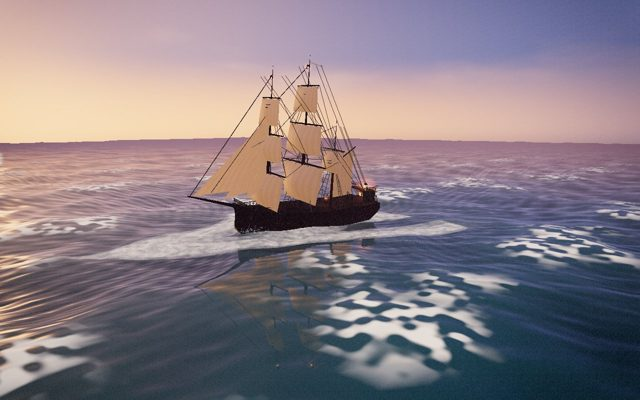](ships/deepseek-flash.omp.html) oh-my-pi · DeepSeek API, earlier run (stopped at 15 min) |  |

Each picture opens the page itself: drag to move the camera. [All of them on one page](ships/index.html).

### 10. Subagent mode

Not run. Every run used each harness's ordinary single-agent mode.

## What the runs cost in subscription allowance

| Plan | Runs | Limit used | How it was read |
|---|---|---|---|
| ChatGPT/Codex subscription | Codex app, nine tasks | 13 points of the 5-hour limit | read after each task |
| ChatGPT/Codex subscription | Capy, nine tasks | 20 points of the 5-hour limit; 3 of the weekly limit | read after each task; one more point went on an attempt that stalled and was run again |
| ChatGPT/Codex subscription | DeepSeek Harness, nine tasks | 12 points of the 5-hour limit; 2 of the weekly limit | 0% before, 12% after, in a fresh window |
| Devin plan | Devin, nine gpt-6.1-sol tasks and one attempt cut off at 15 minutes | about 11 points of the daily limit; 5 of the weekly limit | first reading came four minutes after the first run started |
| Factory plan | Droid, nine gpt-6.1-sol tasks, one attempt cut off at 15 minutes and nine plan-hosted DeepSeek tasks | about 3 points of the weekly limit | one reading, after all of them |

These are whole percentage points from the providers' own meters, mostly single before-and-after readings. They are rough, and the plans' windows differ (5 hours, a day, a week), so they do not convert into one another.

## What this does not show

### Sample size

- **One run per harness, model and task.** The plan has three repeats and one was run. Run-to-run variation was not measured.
- **No pass-rate difference is statistically clear.** A 9 of 9 row has a 95% interval of 70% to 100%.
- **Time, tokens and cost are single measurements.** A second attempt can differ a lot: Devin's first ship attempt was still working at 15 minutes, and its second finished in about 10.

### Tasks

- **Nine small tasks, mostly JavaScript, each a few minutes of work.** Nothing here measures work in a large existing codebase or over a long session.
- **The eight graded tasks are at gpt-6.1-sol's ceiling.** Every run passed, so they cannot separate harnesses on correctness with that model.
- **One author wrote the tasks, checks and reference solutions, with an AI assistant (Claude Code).** The benchmark's code and this write-up were produced the same way. Claude Code is not among the harnesses compared.
- **Hidden checks miss things.** The ship's checks pass pages with visible holes; a check can also encode an assumption the prompt does not state.
- **The ship's brief follows a widely shared one-prompt demo,** so models may have seen similar work.

### Conditions were not identical

- **Two settings.** The Codex app and Capy ran by hand on the Mac, with its GPU and, for the Codex app, the user's own configuration and built-in browser tool. The other eight ran headless in a Linux container with 2 CPUs, 4 GB, no GPU and an empty home directory. Compare times within a group, not across.
- **Software rendering.** In the container a 3D page is drawn without a GPU, and a harness that wanted to look at its page had to install its own tooling first.
- **Hand-run times come from each app's own record** (the Codex app's session logs, Capy's "Worked for" timers), not from the runner's clock.
- **Three routes to one model.** gpt-6.1-sol was reached through the ChatGPT/Codex subscription, Devin's plan and Factory's plan. What each provider sets on its side is not visible.
- **Effort is what was asked for.** DeepSeek has no "medium" level; the first DeepSeek rows asked for it and ran at an unknown effort, so they were run again at high and are kept only in the appendix.
- **The API's `deepseek-flash` and the plans' DeepSeek V4.1 Flash may be different models.**
- **Each harness's own system prompt, tools and defaults are part of what is measured.** Only the model and effort were matched.
- **Second attempts.** Devin's and Droid's gpt-6.1-sol ships and Capy's `log-report` are second attempts; the first attempts' tokens are not counted.
- **The time limit changed during the study,** from 15 to 60 minutes.
- **DeepSeek Harness.** gpt-6.1-sol is not in its built-in model list and was declared in its settings. Its time on that model is measured to its final answer. Two of its nine runs there ended with a connection error after the files were complete and are counted as passed.
- **Network was on.** Harnesses could and did install packages.

### Cost and usage

- **Cost is an estimate, not a bill.** It is tokens multiplied by one price list that has not been checked against the providers' pages.
- **Token counts are each harness's own report,** read by a separate parser per harness. Definitions can differ, for example in whether reasoning is counted as output.
- **Capy reports no tokens per run.** Its cost is its own dollar figure, and one task's share was worked out from its usage total, so it is a floor.
- **Droid reports usage only when a run ends.** Its two stopped ships have no tokens, so its DeepSeek costs are floors.
- **Allowance readings are rough:** whole points, single readings, and some cover mixed runs.

### Judging

- **One judge, one page per harness and model.** Another attempt by the same harness could look different, and another judge could choose differently.
- **The rule favours completeness.** It separates flawed pages from clean ones and does not rank the clean ones against each other.
- **The judge saw the pages running in a desktop browser with a GPU,** not in the software-rendered setting the automatic checks used.
- **Three judged DeepSeek pages come from runs stopped at the time limit.**
- **Blindness covers file names and the judging page.** A page could in principle identify its maker on screen; none was seen to.

### Scope and age

- **Not tested:** Claude Code, Cursor and other harnesses; other models; subagent modes; team or cloud features of any plan.
- **Versions are those of early October 2026.** Harnesses and models change behind the same names; these numbers will age.
- **One machine, one network, one account per provider.**

## Appendix: the superseded DeepSeek rows

The first DeepSeek runs asked for "medium" effort, which DeepSeek does not have, under the 15-minute limit. They are kept for the record and are not used above.

| Harness | Passed | All nine | Eight smaller | Ship | Median task | Cost | Per pass |
|---|---|---:|---:|---:|---:|---|---:|
| OpenCode | 8 of 9 | 17.4 min | 6.1 min | 11.2 min | 52 s | $0.14 | $0.018 |
| Pi | 8 of 9 | 21.7 min | 6.7 min | stopped at 15 min | 52 s | $0.29 | $0.036 |
| oh-my-pi | 8 of 9 | 26.1 min | 11.1 min | stopped at 15 min | 46 s | $0.34 | $0.043 |
| Hermes Agent | 8 of 9 | 31.3 min | 16.3 min | stopped at 15 min | 95 s | at least $0.24 (8 of 9 priced) | unknown |
| Codex CLI | 8 of 9 | 31.4 min | 16.4 min | stopped at 15 min | 67 s | at least $0.32 (8 of 9 priced) | unknown |

## Reproducing it

```sh
docker build -t harness-bench:latest docker/
python3 -m harness_bench check --suite runs/pilot-v1-pinned.json          # tasks, image, versions, logins; no model calls
python3 -m harness_bench run --plan runs/pilot-v1-plan.json --repetition 1  # spends your own keys and allowances
python3 -m harness_bench report --plan runs/pilot-v1-plan.json --html report.html
python3 -m harness_bench judge-prepare --plan runs/pilot-v1-plan.json --task pirate-ship-3d --model gpt-6-1-sol
python3 scripts/publish_first_pass.py
```

## Data

- [`data/results.jsonl`](data/results.jsonl): one record per run, with status, checks, seconds, tokens, cost and notes.
- [`data/plan.json`](data/plan.json): the pinned plan, with task revisions, harness versions, model settings and prices.
- [`data/summary.json`](data/summary.json): the per-harness figures in this write-up.
- [`data/judging/`](https://github.com/Waveorwaves/harness-bench/tree/main/docs/first-pass/data/judging): the pairs, the judge's picks and the rankings.
- [`results/index.html`](results/index.html): the interactive results page, with every run and its failed checks.
- Raw transcripts and the folders each run left are not published; they can hold provider output and login details.
